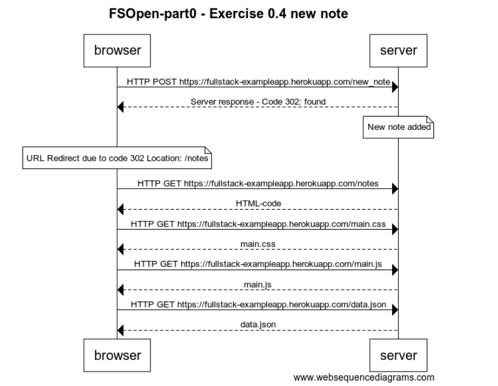

# Full Stack Open

## Exercise 0.4 New note
[Exercises](https://fullstackopen.com/en/part0/fundamentals_of_web_apps#exercises-0-1-0-6)

browser->server: HTTP POST https://fullstack-exampleapp.herokuapp.com/new_note

server-->browser: Server response - Code 302: found

note over server: New note added

note over browser: URL Redirect due to code 302 Location: /notes

browser->server: HTTP GET https://fullstack-exampleapp.herokuapp.com/notes

server-->browser: HTML-code

browser->server: HTTP GET https://fullstack-exampleapp.herokuapp.com/main.css

server-->browser: main.css

browser->server: HTTP GET https://fullstack-exampleapp.herokuapp.com/main.js

server-->browser: main.js

browser->server: HTTP GET https://fullstack-exampleapp.herokuapp.com/data.json

server-->browser: data.json
