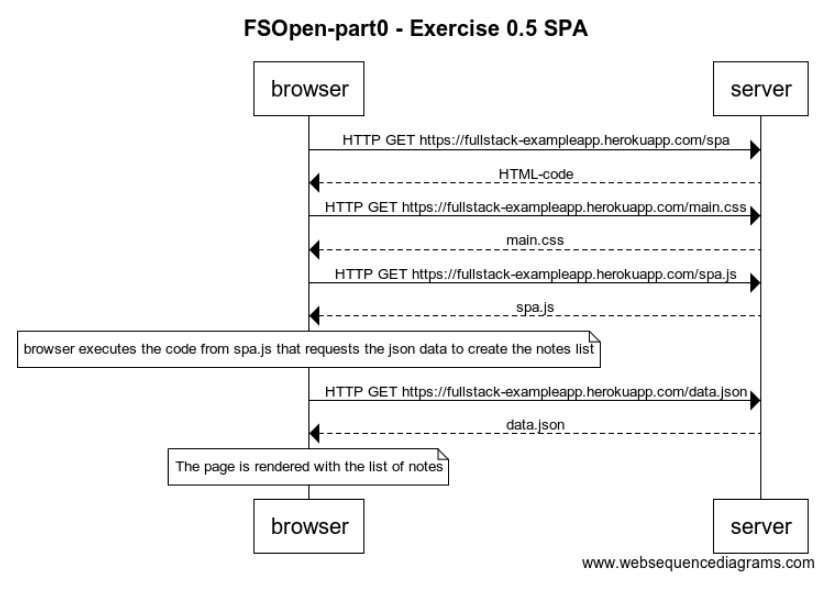

# Full Stack Open

## Exercise 0.5 SPA
[Exercises](https://fullstackopen.com/en/part0/fundamentals_of_web_apps#exercises-0-1-0-6)

Opening the SPA in this case is similar to the default app version. The browser will send the HTTP requests to get the data for the HTML, the CSS and JS files. The spa.js will ask for data in json format and the server will send it. Then the page is rendered with all the notes.

browser->server: HTTP GET https://fullstack-exampleapp.herokuapp.com/spa

server-->browser: HTML-code

browser->server: HTTP GET https://fullstack-exampleapp.herokuapp.com/main.css

server-->browser: main.css

browser->server: HTTP GET https://fullstack-exampleapp.herokuapp.com/spa.js

server-->browser: spa.js

note over browser: browser executes the code from spa.js that requests the json data to create the notes list

browser->server: HTTP GET https://fullstack-exampleapp.herokuapp.com/data.json

server-->browser: data.json

note over browser: The page is rendered with the list of notes
