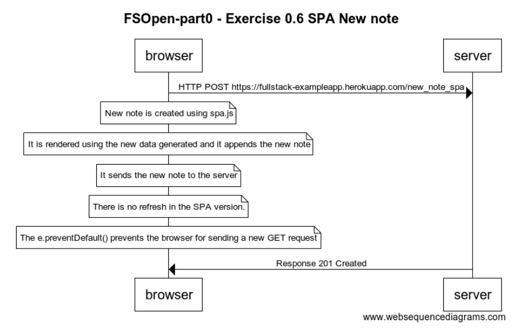

# Full Stack Open

## Exercise 0.6 SPA New note
[Exercises](https://fullstackopen.com/en/part0/fundamentals_of_web_apps#exercises-0-1-0-6)

As explained, in the SPA version of the APP, the form element has no action or method attributes. The JavaScript file generates a new note to be displayed for the users in the list element and also uses e.preventDefault() to prevent the form action and a browser refresh. Then it sends the JSON data to the server.

browser->server: HTTP POST https://fullstack-exampleapp.herokuapp.com/new_note_spa

note over browser: New note is created using spa.js

note over browser: It is rendered using the new data generated and it appends the new note

note over browser: It sends the new note to the server

note over browser: There is no refresh in the SPA version.

note over browser: The e.preventDefault() prevents the browser for sending a new GET request

server->browser: Response 201 Created
